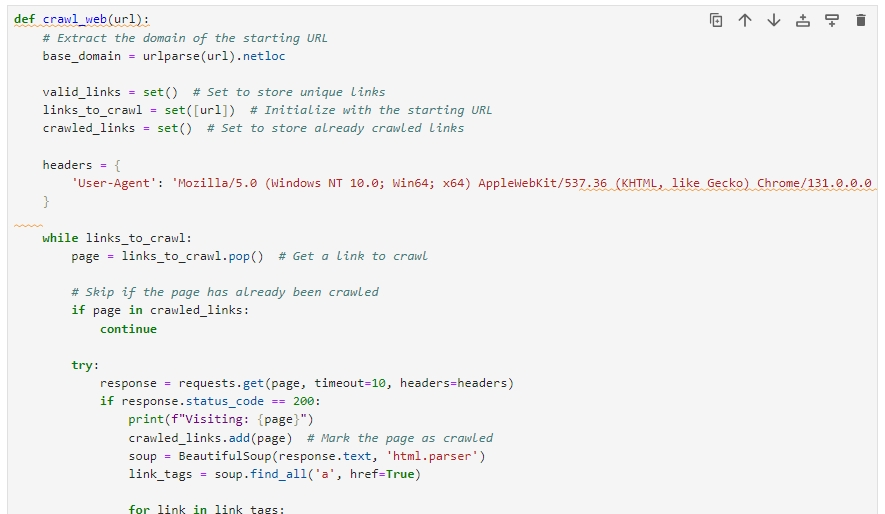

# Link Builder need for Legal Websites

This is a web crawler i made tailord to the clients need

### What was expected.

I am looking for a freelancer who can get links from  specific specific legal websites.

Here are the sites which I need:

https://www.boldbusiness.com/
https://lawandcrime.com/
https://www.law.com/
https://www.abajournal.com/
https://www.law360.com/
https://www.bloomberglaw.com/
https://abovethelaw.com/
https://www.lawyer-monthly.com/
Requirements:

The links should be do-follow, permanent, and not tagged as sponsored.

## What was delivered
The crawler []
## Screenshots

## Documentation

[Documentation](https://linktodocumentation)

